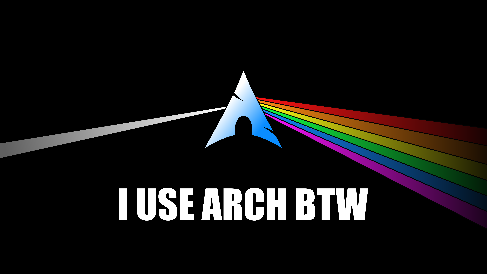
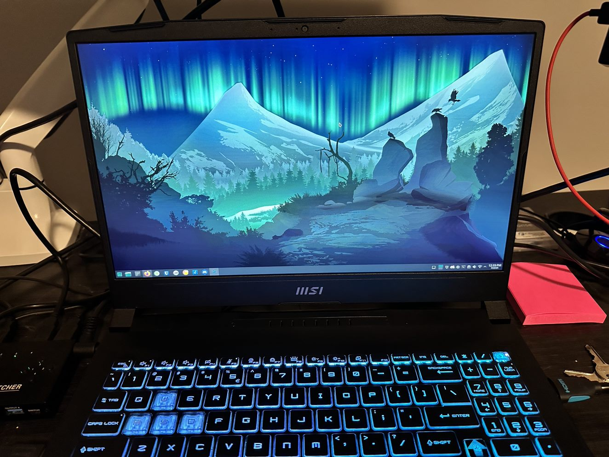
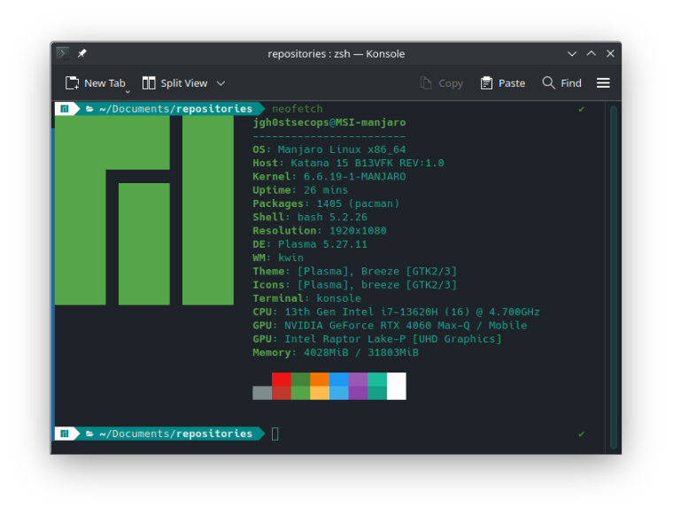
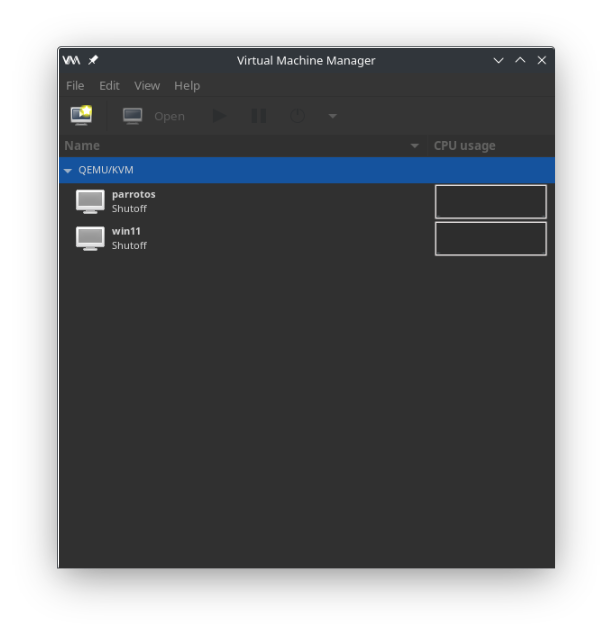
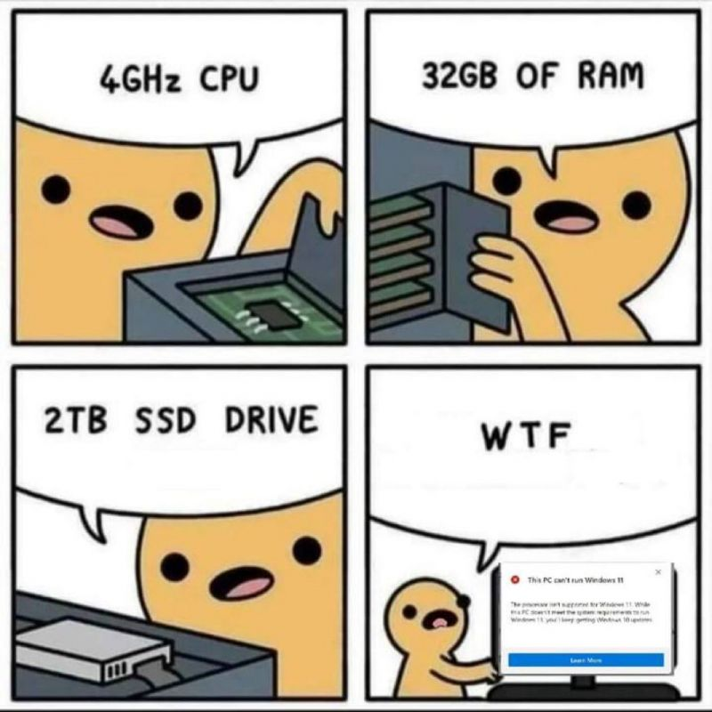
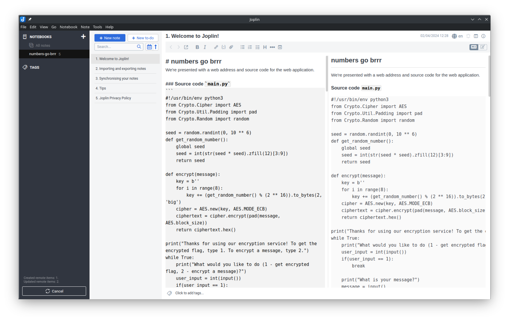

# capture-the-flag
Welcome to my Capture The Flag (CTF) writeup repository. Each event has its own set of markdown files. If this grows large enough, we will set up a Docusaurus instance to hold them.

# Learning resources
[picoCTF resources](https://picoctf.org/resources.html)

[CTFS resources](https://ctfs.github.io/resources/)

[CTFTime writeups](https://feedly.com/i/subscription/feed%2Fhttp%3A%2F%2Fctftime.org%2Fwriteups%2Frss%2F)

[Writing good writing](https://pequalsnp-team.github.io/cheatsheet/writing-good-writeup)

# Platforms
[root-me](https://www.root-me.org/?lang=en)

[hackthebox](https://www.hackthebox.com/)

[tryhackme](https://tryhackme.com/)

[overthewire](https://overthewire.org/wargames/)

[CTFtime](https://ctftime.org/)

# Hardware
Listed below is the hardware I use for CTFs. I chose the device because I could put up to 64GB of DDR5 RAM and it has both integrated GPU and Nvidia GPUs. This will allow me flexibility with virtual machines when future support is added for sharing intel/nvidia hybrid workloads with VMs. The 4060 is also a great mobile GPU for crytographic operations, which is common in CTF events. 

 <!-- Adjust the width as needed -->

If you have questions about what kind of hardware you should look for or information about benchmarking what you have, let me know. You can run with anything much lower spec than this.
## MSI Katana 15 32GB DDR5 5600MHz RAM 4060 MAX-Q 2TB NVMe & 1TB NVMe

 <!-- Adjust the width as needed -->


- [Manjaro](https://manjaro.org/) installed on a 2TB partition
- [Windows 11](https://www.microsoft.com/software-download/windows11) installed on 512GB partition
- [ParrotOS](https://www.parrotsec.org/) installed on another 512GB partition

 <!-- Adjust the width as needed -->


## Virtual Machines
`virt-manager` for VMs. These run well and are easy to manage on Linux. You can utilize the Virtual Machine Manager GUI to create and manage KVMs.

```
pacman -Syu virt-manager
```

 <!-- Adjust the width as needed -->

 <!-- Adjust the width as needed -->

## Notes
[Joplin](https://joplinapp.org/) synced to OneDrive for note taking in markdown. I can then easily transfer the files to GitHub.

 <!-- Adjust the width as needed -->
