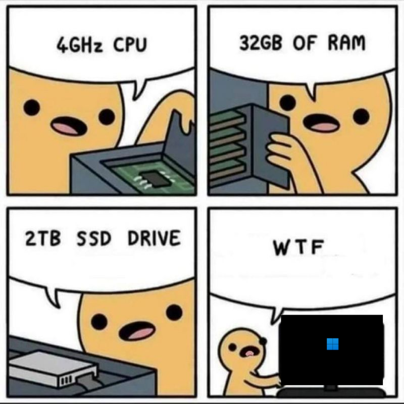

# capture-the-flag
Welcome to my Capture The Flag (CTF) writeup repository. Each event has its own set of markdown files. If this grows large enough, we will set up a Docusaurus instance to hold them.

## Learning resources
[picoCTF resources](https://picoctf.org/resources.html)

[CTFS resources](https://ctfs.github.io/resources/)

[CTFTime writeups](https://feedly.com/i/subscription/feed%2Fhttp%3A%2F%2Fctftime.org%2Fwriteups%2Frss%2F)

[Writing good writing](https://pequalsnp-team.github.io/cheatsheet/writing-good-writeup)

## Platforms
[root-me](https://www.root-me.org/?lang=en)

[hackthebox](https://www.hackthebox.com/)

[tryhackme](https://tryhackme.com/)

[overthewire](https://overthewire.org/wargames/)

[CTFtime](https://ctftime.org/)

## Hardware
Listed below is the hardware and OS preferences I have for my machines.

 <!-- Adjust the width as needed -->

If you have questions about what kind of hardware you should look for or information about benchmarking what you have, let me know. You can run with anything much lower spec than this.
### MSI Katana 15

 <!-- Adjust the width as needed -->


- [Manjaro](https://manjaro.org/) installed on a 2TB partition
- [Windows 11](https://www.microsoft.com/software-download/windows11) installed on 512GB partition
- [ParrotOS](https://www.parrotsec.org/) installed on another 512GB partition

```
██████████████████  ████████   jgh0stsecops@MSI-manjaro 
██████████████████  ████████   ------------------------ 
██████████████████  ████████   OS: Manjaro Linux x86_64 
██████████████████  ████████   Host: Katana 15 B13VFK REV:1.0 
████████            ████████   Kernel: 6.6.19-1-MANJARO 
████████  ████████  ████████   Uptime: 1 hour, 55 mins 
████████  ████████  ████████   Packages: 1406 (pacman), 7 (snap) 
████████  ████████  ████████   Shell: bash 5.2.26 
████████  ████████  ████████   Resolution: 1920x1080 
████████  ████████  ████████   DE: Plasma 5.27.11 
████████  ████████  ████████   WM: kwin 
████████  ████████  ████████   Theme: [Plasma], Breeze [GTK2/3] 
████████  ████████  ████████   Icons: [Plasma], breeze [GTK2/3] 
████████  ████████  ████████   Terminal: konsole 
                               CPU: 13th Gen Intel i7-13620H (16) @ 4.700GHz 
                               GPU: NVIDIA GeForce RTX 4060 Max-Q / Mobile 
                               GPU: Intel Raptor Lake-P [UHD Graphics] 
                               Memory: 7021MiB / 31803MiB 

                                                       
```

#### Virtual Machines
`virt-manager` for VMs. These run well and are easy to manage on Linux. You can utilize the Virtual Machine Manager GUI to create and manage KVMs.

 <!-- Adjust the width as needed -->

 <!-- Adjust the width as needed -->

### 2020 M1 Macbook Pro 13"
Preferred daily driver. However, for CTFs I much prefer x86_64 machines.

### 2022 10.9" iPad Air
Another place to take notes with an apple pen.

### Notes
[Joplin](https://joplinapp.org/) synced to OneDrive for note taking in markdown. I can then easily transfer the files to GitHub. Works across all my gear

 <!-- Adjust the width as needed -->
