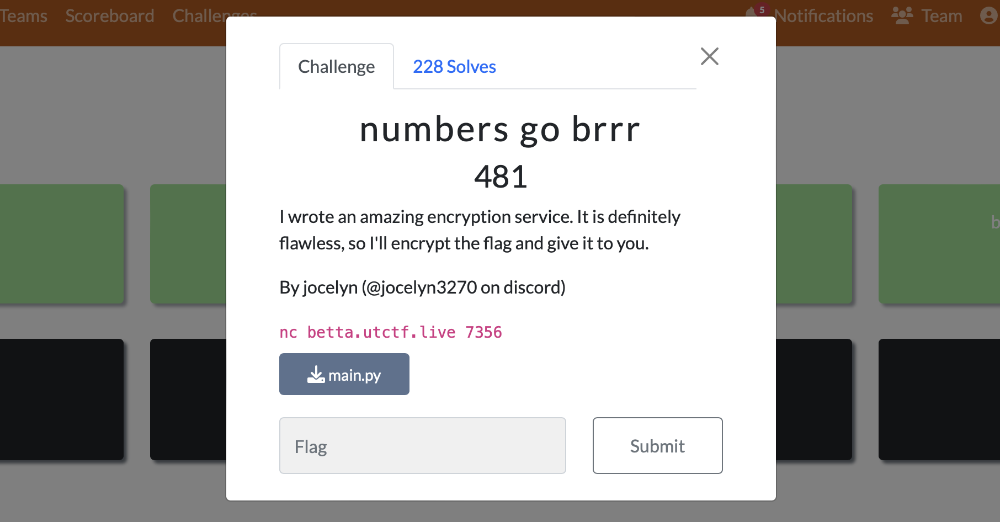

# numbers go brrr

We're presented with a web address and source code for the web application.


### Source code `main.py`
```
#!/usr/bin/env python3
from Crypto.Cipher import AES
from Crypto.Util.Padding import pad
from Crypto.Random import random

seed = random.randint(0, 10 ** 6)
def get_random_number():
    global seed 
    seed = int(str(seed * seed).zfill(12)[3:9])
    return seed

def encrypt(message):
    key = b''
    for i in range(8):
        key += (get_random_number() % (2 ** 16)).to_bytes(2, 'big')
    cipher = AES.new(key, AES.MODE_ECB)
    ciphertext = cipher.encrypt(pad(message, AES.block_size))
    return ciphertext.hex()

print("Thanks for using our encryption service! To get the encrypted flag, type 1. To encrypt a message, type 2.")
while True:
    print("What would you like to do (1 - get encrypted flag, 2 - encrypt a message)?")
    user_input = int(input())
    if(user_input == 1):
        break

    print("What is your message?")
    message = input()
    print("Here is your encrypted message:", encrypt(message.encode()))


flag = open('/src/flag.txt', 'r').read();
print("Here is the encrypted flag:", encrypt(flag.encode()))

```

The vulnerability in the code is readily identifiable; it stems from the random number generator's seed and output being limited to a narrow range, specifically from 000000 to 999999. This constraint significantly reduces the complexity and security of the cryptographic process, making it susceptible to brute-force attacks.

#### Vulnerable code
```
#!/usr/bin/env python3
from Crypto.Cipher import AES
from Crypto.Util.Padding import pad
from Crypto.Random import random

seed = random.randint(0, 10 ** 6)
def get_random_number():
    global seed 
    seed = int(str(seed * seed).zfill(12)[3:9])
    return seed
```

### Pull down an encrypted flag from the web server 
```
┌──(jgh0stsecops㉿MSI)-[~]
└─$ nc betta.utctf.live 7356
Thanks for using our encryption service! To get the encrypted flag, type 1. To encrypt a message, type 2.
What would you like to do (1 - get encrypted flag, 2 - encrypt a message)?
1
Here is the encrypted flag: 45dcf16ba927a1e9cbaafe1736205cd1593a809f52268a99381e0375ddde5b5020f3515edf49f658abc94460dc1d9fd9
```


### Write new code with brute force logic based on the original named `decrypt.py`
```
from Crypto.Cipher import AES
from Crypto.Util.Padding import unpad

def get_random_number(seed):
    return int(str(seed * seed).zfill(12)[3:9])

def decrypt(ciphertext, key):
    cipher = AES.new(key, AES.MODE_ECB)
    try:
        plaintext = unpad(cipher.decrypt(ciphertext), AES.block_size)
    except ValueError:
        return None
    return plaintext

def brute_force_decrypt(ciphertext):
    for seed in range(10**6):
        temp_seed = seed
        key = b''
        for _ in range(8):
            temp_seed = get_random_number(temp_seed)
            key += (temp_seed % (2 ** 16)).to_bytes(2, 'big')

        plaintext = decrypt(ciphertext, key)
        if plaintext and all(32 <= c <= 126 for c in plaintext):  # Check if plaintext is readable
            return plaintext

    return None

# Hex-encoded ciphertext
ciphertext_hex = "45dcf16ba927a1e9cbaafe1736205cd1593a809f52268a99381e0375ddde5b5020f3515edf49f658abc94460dc1d9fd9"
ciphertext = bytes.fromhex(ciphertext_hex)

# Attempt to brute force decrypt
decrypted_message = brute_force_decrypt(ciphertext)
if decrypted_message:
    print("Decrypted message:", decrypted_message.decode())
else:
    print("Failed to decrypt the message.")

```
### Execute and get the flag
```
┌──(jgh0stsecops㉿MSI)-[~/capture-the-flag/UTCTF/2024/cryptography/numbers-go-brrr]
└─$ python3 decrypt.py
Decrypted message: utflag{deep_seated_and_recurring_self-doubts}
```

### Why this works
The exploit works because the encryption script uses a predictable pseudo-random number generator with a limited seed space of one million possibilities. By squaring the seed and extracting the middle digits, the script follows a deterministic pattern that can be replicated. 

The decryption script takes advantage of this predictability by brute-forcing through all possible seeds to reconstruct the same sequence of keys used for encryption. Once the correct key is found, the ciphertext can be decrypted, revealing the original message, because the key generation process is entirely dependent on the predictable PRNG output.


### Technical Analysis of the Script

1. **Predictable Seed Generation**: 
   - The `seed` is generated using `random.randint(0, 10 ** 6)`, which limits the seed to a million possibilities. This is not secure for cryptographic purposes.

2. **Pseudo-Random Number Generation**: 
   - The `get_random_number` function squares the seed, pads it to 12 digits, and extracts the middle six digits to produce the next seed. This method is predictable and not suitable for cryptographic applications.

3. **Key Generation**: 
   - The `brute_force_decrypt` function iterates over all possible seed values to generate a 128-bit AES key from eight generated numbers, each contributing 16 bits.
   - The script performs a brute-force attack over the limited seed space, checking for plaintext readability to identify the correct decryption key.

#### Technical Details

**Key Derivation**: 
- Key derivation in the script lacks cryptographic strength. A secure KDF should be employed to ensure key unpredictability and resistance to attacks.

**Entropy and Randomness** 
- The security of the PRNG is heavily dependent on the seed's entropy. Using a higher entropy source for seed generation is crucial for preventing predictability.

### Learning Resources
**Python Cryptography**:
- [`pycryptodome` library documentation.](https://pycryptodome.readthedocs.io/en/latest/)
- ["Serious Cryptography" by Jean-Philippe Aumasson.](https://www.amazon.com/Serious-Cryptography-Practical-Introduction-Encryption/dp/1593278268)

**Online Courses**:
- [Cryptography courses on Coursera](https://www.coursera.org/search?query=Cryptography)
- [Cryptopals challenges.](https://cryptopals.com)

**Security Practices**:
- [OWASP guidelines on secure coding.](https://owasp.org/www-project-secure-coding-practices-quick-reference-guide/stable-en/01-introduction/05-introduction)
- [NIST publication on random bit generation.](https://csrc.nist.gov/projects/random-bit-generation)
